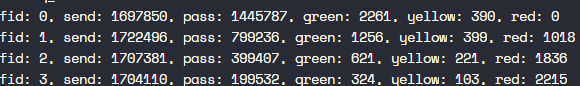
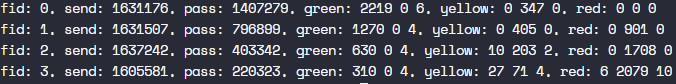

# report

516030910233 黎君

## 参数推导

优化的两个目标：flow0达到指定带宽，每个flow的带宽分配达到指定比例

flow0指定带宽1.28Gbps=160,000,000Bps

模拟总时间为10 * 1,000,000ns = 0.01s

所以输出结果中flow0的pass要接近1,600,000，其他flow要与flow0达成8：4：2：1的比例

### 思路1：RED drop掉所有YELLOW，RED，从不drop GREEN，srTCM负责控制带宽

RED参数对每个流都相同，为
```c
{.min_th = 1022, .max_th = 1023, .maxp_inv = 10, .wq_log2 = 9}, // GREEN
{.min_th = 1, .max_th = 2, .maxp_inv = 1, .wq_log2 = 9}, // YELLOW
{.min_th = 1, .max_th = 2, .maxp_inv = 1, .wq_log2 = 9} // RED
```

srTCM的参数对应每个流的带宽

cir = bandwidth, cbs = cir * rtt, ces = cbs

因为队列每1,000,000ns = 0.001s清空一次，所以其中rtt=0.001s

示例结果：



### 思路2：按比例drop

srTCM参数一样

RED参数对每个流也相同，为
```c
{.min_th = 250, .max_th = 500, .maxp_inv = 10, .wq_log2 = 9}, // GREEN
{.min_th = 25, .max_th = 75, .maxp_inv = 5, .wq_log2 = 9}, // YELLOW
{.min_th = 25, .max_th = 75, .maxp_inv = 2, .wq_log2 = 9} // RED
```

由于q_size最大为1000，去green的max_th为q_size/2, min_th为q_size/4

示例结果


颜色后面跟的三个数字分别对应qos_dropper_run的三个返回值：通过，超出max_th，在min_th和max_th之间由于概率被丢弃

可以看到对flow0基本和思路一一样，但是对低优先级的流，YELLOW和RED反而有一些包能通过

调整YELLOW和RED的参数能在保证高优先级的流的QoS的情况下提升总带宽利用率

## dpdk API

```c
uint64_t rte_get_tsc_cycles() // 以CPU cycle为单位获取当前timestamp
uint64_t rte_get_tsc_hz() // 获取rdtsc的频率，每秒多少个CPU cycle

// 初始化srtcm配置
int 
rte_meter_srtcm_config(struct rte_meter_srtcm *m,
	struct rte_meter_srtcm_params *params);

// srtcm标记函数，色盲模式，其中time单位为CPU cycle
// 但是测试环境中time为nanoseconds，所以需要进行换算
// uint64_t tsc = init_tsc + (tsc_frequency + NANO_PER_S - 1) / NANO_PER_S * time;
// init_tsc为meter初始化时的timestamp，tsc_frequency为rte_get_tsc_hz返回值，NANO_PER_S为1,000,000,000
static inline enum rte_meter_color
rte_meter_srtcm_color_blind_check(struct rte_meter_srtcm *m,
	uint64_t time,
	uint32_t pkt_len);

// 下面两个函数用作red的初始化
int
rte_red_rt_data_init(struct rte_red *red);

int
rte_red_config_init(struct rte_red_config *red_cfg,
	const uint16_t wq_log2,
	const uint16_t min_th,
	const uint16_t max_th,
	const uint16_t maxp_inv);

// 队列清空时需使用此函数进行标记
static inline void
rte_red_mark_queue_empty(struct rte_red *red, const uint64_t time);

// 根据red配置和传进来的q参数(更新后的队列长)判断是否drop
static inline int
rte_red_enqueue(const struct rte_red_config *red_cfg,
	struct rte_red *red,
	const unsigned q,
	const uint64_t time);

```